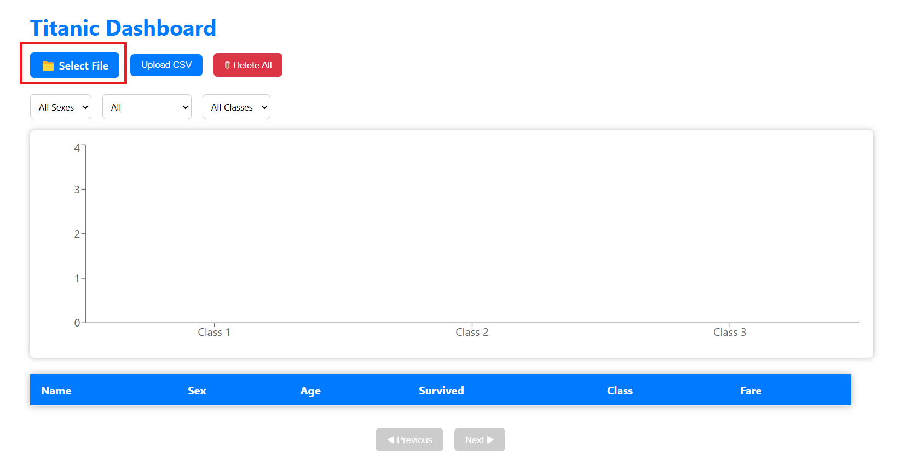
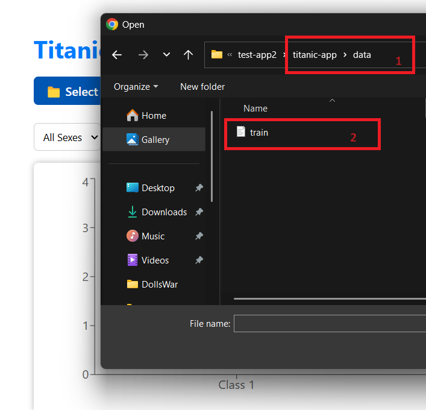
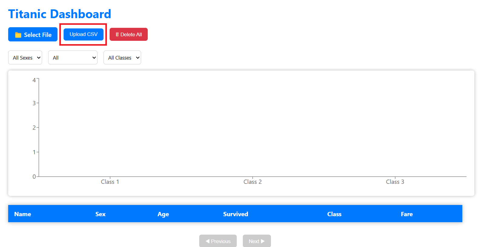
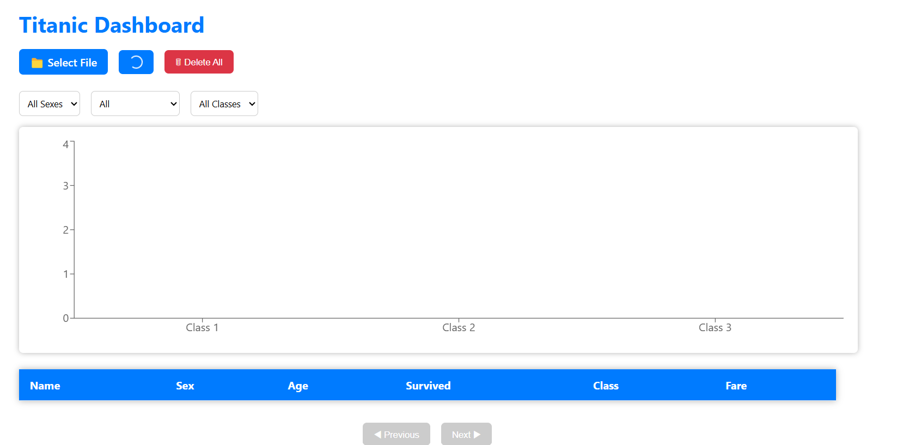
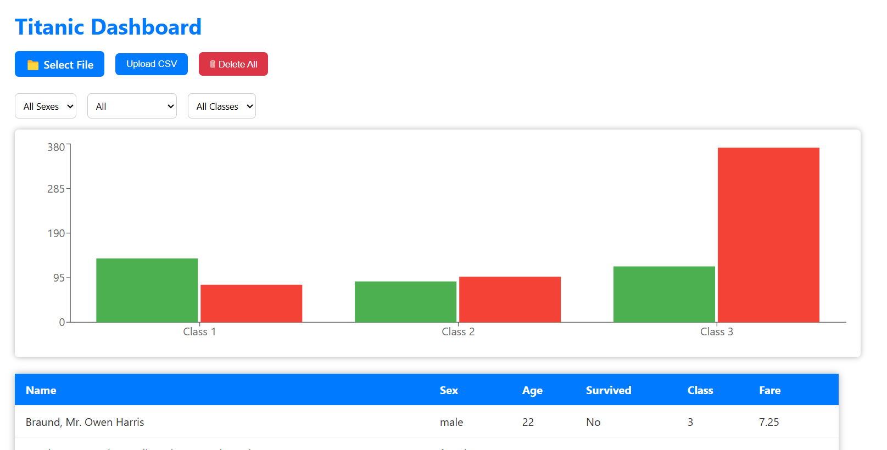
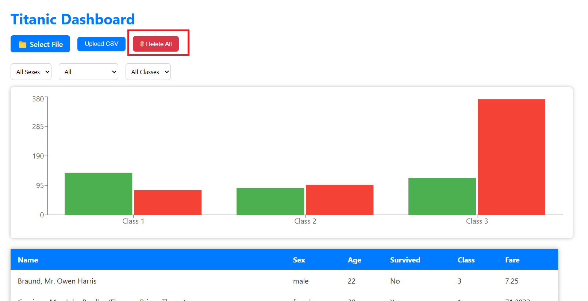

# Titanic Dashboard App

A full-stack Titanic data visualization dashboard where users can:

    - Upload Titanic passenger data as CSV
    - Filter passengers by class, gender, and survival status
    - View a data table and survival statistics chart
    - Manage passenger records

## 🛠️ Tech Stack

- **Frontend:** React, Recharts, React Toastify, Jest, React Testing Library
- **Backend:** Django, Django REST Framework, Django Filters, Pandas
- **Containerization:** Docker, Docker Compose

## 🚀 Getting Started

### 1. Clone the repository

```bash
git clone https://github.com/IchoubaneMed/titanic-app.git
cd titanic-app
```

### 2. Build and start services

```bash
docker-compose build
docker-compose up -d
docker-compose exec web python manage.py migrate
```
    - Frontend will be available at http://localhost:5173/
    - Backend API will be served at http://localhost:8000/

## 🖱️ How to Use the App

1. Click on the **Select File** button 
    

2. Choose a CSV file from the `data` folder

    

3. Click **Upload CSV** to submit
    
    
    

4. To delete all records, click **Delete All**
    


## 📂 Project Structure

```bash
titanic-dashboard/
├── backend/
│   ├── apis/                  # Django app: views, models, serializers
│   ├── django_project/        # Django project config
│   └── requirements.txt
├── frontend/
│   ├── src/
│   │   ├── components/        # React components
│   │   ├── hooks/             # Custom hooks
│   │   └── api/               # API utilities
│   └── package.json
├── docker-compose.yml
```

## ✅ Running Tests

### Frontend

```bash
docker-compose exec frontend npm test
```

### Backend

```bash
docker-compose exec web python manage.py test
```

## 📤 Upload Format

Your CSV must follow this structure (case-sensitive headers):
```bash
PassengerId,Survived,Pclass,Name,Sex,Age,SibSp,Parch,Ticket,Fare,Cabin,Embarked
```

## ⚙️ API Endpoints (Backend)

| Method | Endpoint                      | Description                             |
| ------ | ----------------------------- | --------------------------------------- |
| POST   | `/api/upload/`                | Upload CSV file                         |
| GET    | `/api/passengers/`            | Paginated passengers with filters       |
| GET    | `/api/passengers/all/`        | All filtered passengers (no pagination) |
| DELETE | `/api/passengers/delete_all/` | Delete all passengers                   |

## 👤 Author

    - Developed by [Mohamed Ichoubane]
    - Feel free to reach out at: mohamedichoubanetata@gmail.com
